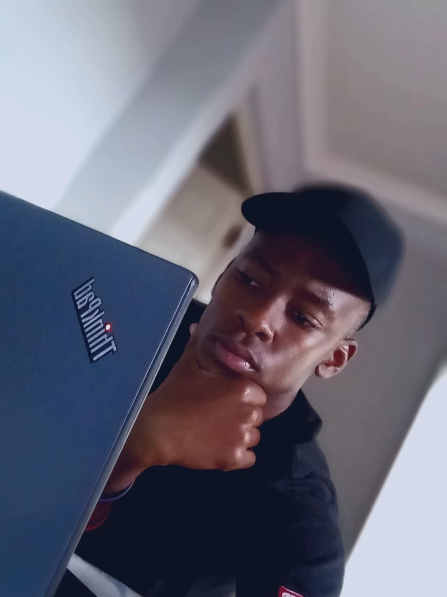

# Matinisa Lubisi

## Contact

- 445 Schoemansdaal
- Mpumalanga, SA
- 071 190 9253
- [222527269@mycput.ac.za](mailto:222527269@mycput.ac.za)

## Education
***Hight School:***

 Njeyeza High School, (2019-2021)
 
 Mpumalanga, Nkomazi district

***Higher Institution :***

Cape Peninsula University of Technology

 CapeTown
 District 6, WC
  
  DIPLOMA IN INFORMATICS AND COMMUNICATIONS TECHNOLOGY
 
 ## Techical Skills
 
 - Java
 - Python
 - SQL
 - Java Script
 - HTML
 - CSS
 
 
 
 ## Profile
 Analytical and results-driven Application Development 
 student with strong foundations in Java and object-oriented programming,
 experienced in developing GUI-based applications, implementing file handling,
 applying design patterns, and integrating databases. Demonstrates solid problem-solving 
 ability through academic and group software projects, with a growing focus on backend 
 development and networking concepts. Eager to contribute to a development team, 
 learn industry best practices, and deliver clean, maintainable code in real-world environments.
 
 ## Experience
 
 ***ModuleTracker and Mark Calculator |***
 ***Feb 2025 - November 2025***
 
 ##### CPUT | UnderGraduate Group Project
 
 The mark calculating application was developed in the usage of Java programming language,
 and some touch of Java script, HTML, and CSS for styling.
For the development of the database, we have decided to use python since it is of less complex syntax
and as for the data manipulation, we used MongoDB

 ***Pizza Management System Interface Design |***
 ***April 2025 - June 2025***
 
 ##### CPUT | Undergraduate Group Project
 
 The system user interface design of the system was designed with the usage of an online platform,
 named Figma, which was facilitated through the involvement of user-story
 
 
 ***NON GOVERNMENTAL ORGANIZATION WEBSITE |***
 ***FEBRUARY 2024- NOVEMBER 2024***
 
 ##### CPUT | Undergraduate Group Project
 
 This was an NGO website which was developed for local-community-organization
 which specialized in promoting hygiene techniques to members of the community,
 which allowed community members who wanted to volunteer on the cleaning the community
 to register on the website for recruitment purposes

 #####Small Mock Interview Video

<iframe width="560" height="315" src="Mock interview Edited.mp4" frameborder="0"
 allow="accelerometer; autoplay; clipboard-write; encrypted-media; gyroscope; 
 picture-in-picture" allowfullscreen></iframe>

 
