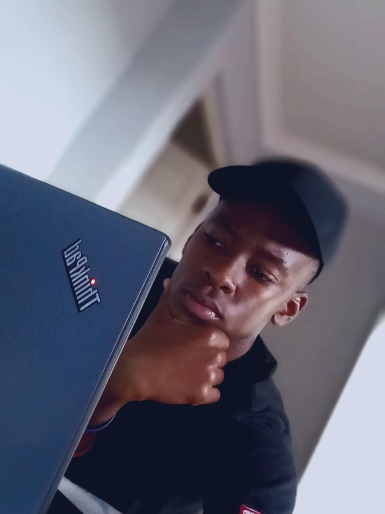

# Matinisa Lubisi

## Contact

- 445 Schoemansdaal
- Mpumalanga, SA
- 071 190 9253
- [222527269@mycput.ac.za](mailto:222527269@mycput.ac.za)

## Education
***High School:***

 Njeyeza High School, (2019-2021)
 
 Mpumalanga, Nkomazi district

***Higher Institution :***

Cape Peninsula University of Technology

 CapeTown
 District 6, WC
  
  DIPLOMA IN INFORMATICS AND COMMUNICATIONS TECHNOLOGY
 
 ## Technical Skills
 
 - Java
 - Python
 - SQL
 - Java Script
 - HTML
 - CSS
 
 
 
 ## Profile
 Analytical and results-driven Application Development 
 student with strong foundations in Java and object-oriented programming,
 experienced in developing GUI-based applications, implementing file handling,
 applying design patterns, and integrating databases. Demonstrates solid problem-solving 
 ability through academic and group software projects, with a growing focus on backend 
 development and networking concepts. Eager to contribute to a development team, 
 learn industry best practices, and deliver clean, maintainable code in real-world environments.
 
 ## Experience

 ***Campus Smart Attendance System |***
 ***March 2026-present***
 ##### CPUT | Third year undergraduate Group project

 This is an IoT system which assist student along with lectures to track the number of students attended a class, without calculating 
 them manually. So the system operate by using RFID card for each student that whenever before entering a class, in order to get access, 
 they must tap their RFID card to the attendance system which marks them presents after tapping. The system components configuration was programed 
 behind the usage of C++, using the arduino IDE, along with necesary components which included ESP32, RFID card and some Duno Jumper wires for connection

  ***Campus Smart Clinic System |***
 ***February 2026-November 2026***
 ##### CPUT | Third year undergraduate Group project

 The campus smart clinic system, go by the name "Pulse-up", is a mobile application for student
  which enables students to book appointments to their on-campus clinic which minimises the physical quering for prescribed remedies 
  and some short medical sessions, instead, everything is done through the application. The application consist of student side and admin
   side, where-as the student side is where appointments booking are done, and the admin side, is where the booked appointments are managed.
   The front-end of the system was creates using "***HTML*** for the page structure, "***CSS***" for the look and feel of the website and
    "***JavaScript***" for page inter-action. The framework used for front-end was "***BootStrap***" which provide necessary CSS and HTML elements. As for the back-end, members of the back-end decided to use "***Java***" programming language, which was chosen because of the ability to effectively communicate with the database. As for frame work, we used "***Java Springboot***" which is used handle complex configurations automatically. For the overal development of the system, as for an IDE, we used "***VS Code***" as it supports a majority of programming language and necessary plug-ins.
 
 ***ModuleTracker and Mark Calculator |***
 ***Feb 2025 - November 2025***
 
 ##### CPUT | UnderGraduate Group Project
 
 The mark calculating application was developed in the usage of Java programming language,involving the
 springboot frame work for datab ase enhancement,and some touch of Java script, HTML, and CSS for styling, along with
 Springboot framework as it facillitatews the provision of some HTML and CSS components.
For the development of the database, we have decided to use python since it is of less complex syntax
and as for the data manipulation, we used MongoDB

 ***Pizza Management System Interface Design |***
 ***April 2025 - June 2025***
 
 ##### CPUT | Undergraduate Group Project
 
 The system user interface design was designed with the usage of an online platform,
 named Figma, which was facilitated through the involvement of user-story as i was only
 assigned with designing the wireframes only due to the exceptional figma literal skillset.

 The following click-able link will take you to the figma page, where the prototyping of the design happens, which include field and button interaction, as it does not include bussiness logic functionality:
[OpenAI](https://www.figma.com/proto/IwICeRmaDRD2SgrsFnntPZ/ISA-4th-term-assignment?node-id=85-5&starting-point-node-id=85%3A5)
 
 
 ***NON GOVERNMENTAL ORGANIZATION WEBSITE |***
 ***FEBRUARY 2024- NOVEMBER 2024***
 
 ##### CPUT | Undergraduate Group Project
 
 This was an NGO website which was developed for local-community-organization
 which specialized in promoting hygiene techniques to members of the community,
 which allowed community members who wanted to volunteer on the cleaning the community
 to register on the website for recruitment purposes. The system was designed behind the usage
 of VS code IDE, as it supports a majority of programming language, as were  using HTML for the structure, 
 CSS for the content design and JS for functionality. As i was specializing with the back-end part of the system
 which includes the design of the database, i decided to use the springboot framework, since it support and allows
 some system testing techniques.

 ##### Here's a Mock-interview Video link
 

 
